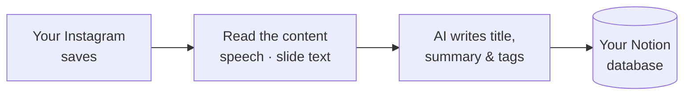
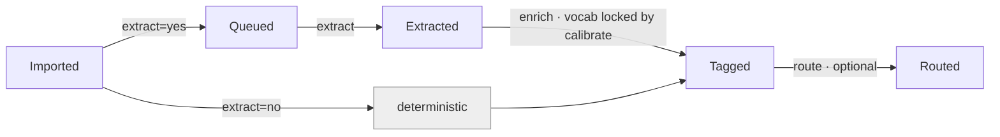

# Insta-Save

Turn your Instagram saves into a searchable, organized Notion database — each post with a
**title, summary, and tags**, so you never need to re-open the original.

> **Status:** the one-call orchestrator (`isa run --mode first-time|incremental`) is live —
> a full clean run through every stage, resumable and crash-safe via Notion state. 546 tests passing.

## Contents

**Get started**
- [What it is](#what-it-is) — what Insta-Save does, in plain terms
- [Quickstart](#quickstart) — install and run

**Reference**
- [How it works](#how-it-works) — the pipeline and status flow
- [Setup](#setup) · [Configuration](#configuration) · [Running](#running) · [Backends](#backends)
- [Calibration](#calibration) · [The enrich loop](#the-enrich-loop-session-backends)
- [Failures, guardrails, backup](#failures-guardrails-backup) · [Reprocessing](#reprocessing) · [Troubleshooting](#troubleshooting)
- [Requirements](#requirements) · [Repo layout](#repo-layout)

---

## What it is

You save a lot on Instagram and never look at it again. Insta-Save fixes that. It pulls in
everything you've saved and turns it into a tidy, searchable **Notion database** — one row per
post, each with a clear **title, short summary, and tags** — so you can actually find what you
saved.

It doesn't just copy the caption. For each post it looks at what's *inside*: it transcribes the
speech in Reels and reads the text on slide images, then has an AI write the title, summary, and
tags from what the post actually contains. The payoff — you rarely need to open the original post
again.



You point it at your Notion database once, tell it which saved collections you care about, and run
it. It works through them group by group and writes to Notion as it goes — and if it's ever
interrupted, it picks up right where it left off.

**Two ways to run it:** a **first-time** pass over your whole archive, and an **incremental** pass
you run later to pick up just the new saves. The [Quickstart](#quickstart) gets you going in a few
commands; everything past the divider is reference you only reach for when you need it.

## Quickstart

```bash
# 1. Install
python -m venv .venv && source .venv/bin/activate
pip install -e .
playwright install chromium
sudo apt install ffmpeg              # transcript/OCR media handling

# 2. Configure — Notion token/database ID, IG username (see Setup)
cp .env.example .env
cp config/run.example.json config/run.json

# 3. Discover collections + set group / order / extract (interactive, first time)
isa discover

# 4. First-time bulk run (group-by-group, with calibration)
isa run --mode first-time

# 5. Later — pick up new saves
isa run --mode incremental --fresh

# Anytime
isa status     # per-group counts, failures, what's left
isa backup     # snapshot Notion to JSON
```

---

*Everything below is reference — configuration, the full command surface, and operating recipes.
Jump to what you need via the [Contents](#contents) above.*

## How it works

Notion holds the state. Each post has a `status`, and a run reads that status, does the next step,
and writes it back — there's no separate queue or database. That's why a run is always resumable:
re-running only picks up items that still need work.



- **Extract-path** items (collections you mark `extract=yes`) get transcript/OCR, then LLM enrichment.
- **Deterministic** items (`extract=no`) are tagged straight from their collection — no transcript, no LLM.
- **Calibrate** is a one-time human gate per group that locks its tag vocabulary before enrich runs.

`isa run` handles discovery and import, then a **sequencer** drives each group through the
remaining steps one action at a time. `--fresh` (incremental mode) forces a re-crawl to catch new
posts. The full internal design lives in `.claude/docs/ARCHITECTURE.md`.

## Setup

**Notion:** create a full-page database, create an integration (Settings → Integrations),
connect it to the database, then copy the integration secret and the 32-char database ID from
the URL. Schema properties are created automatically on first write.

**`.env`** (secrets — never committed):

| Variable | Meaning |
|---|---|
| `NOTION_TOKEN` | Notion integration secret |
| `NOTION_DATABASE_ID` | 32-char database ID |
| `IG_USERNAME` | Instagram handle (no `@`) |
| `ANTHROPIC_API_KEY` | only for the `api` enrich backend |
| `OLLAMA_BASE_URL` | only for `local` (default `http://localhost:11434`) |

## Configuration

All config files live in `config/`. Private ones are gitignored.

### `run.json` — how a run behaves *(committed example: `run.example.json`)*

```json
{
  "mode": "first-time",
  "ordering": "collections.json",
  "enrich": { "backend": "claude-p", "model": "claude-sonnet", "effort": "medium" },
  "extract": {
    "transcript": { "model": "small", "vad": true },
    "ocr": { "mode": "rapidocr" }
  },
  "batch": { "max_items": 15, "max_char_budget": 80000, "max_image_tokens": 120000 },
  "guardrails": { "max_items_per_run": null, "max_spend_usd": null }
}
```

- **`enrich.backend`** — `claude-p | api | local | cowork | claude-code`. **`model`/`effort`** — effort maps to thinking budget (`api`), model size (`local`), advisory (sessions).
- **`extract.transcript`** — `model`: `base | small | distil-large-v3`; `vad`: Silero voice-activity filter (recommended on).
- **`extract.ocr.mode`** — `none | rapidocr`. RapidOCR runs on every carousel/post slide (images persisted to `tmp/slides/<shortcode>/` for the vision enrich lane) and on sampled reel frames (ephemeral).
- **`batch.max_image_tokens`** — cap on total estimated image tokens per vision-lane batch (≈ 1600 tokens/slide); vision lane only. Text lane uses `max_char_budget`.
- **`guardrails`** — hard caps; a run stops before exceeding them. Set `max_spend_usd` for the `api` backend.

### `collections.json` — groups + grouping + extract *(private, gitignored)*

```json
{
  "groups": ["Hustling", "Biz", "Creative", "Content", "Lifestyle", "uncategorized"],
  "collections": {
    "Coding - AI":      { "group": "Hustling",  "extract": true },
    "Website Handling": { "group": "Hustling",  "extract": true },
    "Makeup":           { "group": "Lifestyle", "extract": false }
  }
}
```

- **`groups`** — ordered list; processing runs in this order. You order ~6 groups, not every folder. Group names live here (private), never in committed code.
- **`group`** / **`extract`** — which group a collection belongs to; `true` → transcript/OCR + LLM enrich, `false` → deterministic branch (tag from collection, title from caption/author).
- A cross-group item is enriched at its **last** `extract=yes` group in `groups` order. Items in no named collection fall into `uncategorized` (processed last).

Generate/refresh with `isa discover` (interactive first run; smart-merge afterwards — only prompts for new/removed collections, preserves annotations).

### `tags.json` — tag vocabulary *(private, gitignored)*

Per-group + cross-group tags with one-line definitions. Built during **calibration**, not by hand.

```json
{
  "content_type": { "tool": "a thing to use", "explainer": "how it works" },
  "groups":  { "Hustling": { "seo": "search ranking & visibility" } },
  "cross_group": { "ai": "AI applied in a non-eng domain" }
}
```

### `routes.json` — optional routing *(committed example)*

Maps `tag > collection > group → route_target` (tag wins, then collection, then group default). Omit or empty to leave items at `Tagged`.

## Running

```bash
isa discover                  # surface collections + links; configure / diff
isa run --mode first-time     # bulk: per group → extract → calibrate → enrich
isa run --mode incremental    # delta: new saves only, reuse locked vocab
isa run --stage extract       # run a single stage
isa status                    # per-group counts: imported/extracted/tagged/failed/left
isa backup [--restore-check]  # snapshot Notion to JSON (+ optional restore test)
```

**Flag reference (allowed values):**
```
isa run   --mode  {first-time | incremental}        # default: incremental
          --stage {discover | ingest | select | extract | calibrate | enrich | deterministic | route}
          --group <name>        # restrict to one group (e.g. calibrate a single group)
          --limit <N>           # cap items processed this run
          --lane  {text | vision}   # enrich only: text=Reels/IGTV (default), vision=Carousels/Posts
          --reextract           # re-run extract on already-Extracted items
          --retry-failed        # reprocess items currently in Failed
          --fresh               # force a current re-crawl (incremental mode)
          --dry-run             # compute the plan, no writes
isa status --retry-failed       # requeue Failed items to their inferred prior status
```
Omit `--stage` to run the whole mode end-to-end. **Preflight** runs before any run (backend
reachable, Notion credentials present, engines importable) and fails fast with a clear message.

**First-time order per group:** `extract` → `calibrate` (lock vocab) → `enrich` → spot-check → next group.
**Incremental** runs the same stages on the new delta only, with no calibration (vocab already locked).

## Backends

Choose how LLM enrichment runs — set once in `run.json`; the pipeline works with any:

| Backend | What it is | Automated | Vision | Cost |
|---|---|---|---|---|
| `claude-p` | headless `claude -p` subprocess (**default**) | yes | yes | Claude Max, no API key |
| `api` | Anthropic API | yes | yes | per-token |
| `local` | Ollama, on your machine | yes | – | free |
| `cowork` | a self-paced Claude Cowork loop | semi | yes | subscription |
| `claude-code` | a Claude Code session | semi | yes | subscription |

Extraction (transcript/OCR) always runs locally. Carousel/Post slide images are persisted and
fed to a separate vision enrich lane; Reels stay text-only. `semi`-automated backends are
agent-filled: a session writes `results.json`, then `isa run --stage enrich --apply` applies it.

## Calibration

Tagging accuracy is front-loaded here so the full run needs little correction.

1. `isa run --stage calibrate --group "<Group>"` samples the group's `extract=yes` collections'
   items and the backend **proposes** a candidate vocab.
2. Review via the interactive gate — accept, edit topic-by-topic, or open the draft/whole file in `$EDITOR`.
3. Preview the diff and **lock** it (guarded by an explicit discard-confirmation step).
4. The sequencer immediately re-plans that group into `enrich`.

Cross-group items receive the **union** of their groups' vocab and are enriched once, when the **last** of their groups runs.

## The enrich loop (session backends)

For `claude-code` / `cowork`, enrichment runs as a review-friendly loop. All state lives in
Notion + `tmp/enrich/`, so it is **crash-resumable and compaction-safe**. Enrich runs **two
modality lanes per group** — drain text first, then vision:

**Text lane** (`--lane text`, default) — Reels/IGTV, text-only prompt:
1. `isa run --stage enrich --lane text` prepares the next batch → `tmp/enrich/prompt.txt`.
2. The session reads the prompt, writes `tmp/enrich/results.json`.
3. Results are applied to Notion (`Tagged`); repeat until drained.

**Vision lane** (`--lane vision`) — Carousels/Posts; prompt lists slide image paths to `Read`:
1. `isa run --stage enrich --lane vision` prepares the batch → prompt with `IMAGES:` blocks (absolute slide paths).
2. The session reads the prompt + each image, writes `results.json`.
3. Applied to Notion; repeat until drained.

In **Cowork**, one kickoff message per lane drives the loop; if the session dies, restart and
Notion status resumes exactly where it left off. `claude-p`/`local`/`api` do steps 1–3 automatically.

## Failures, guardrails, backup

- **Failure triage:** `isa status` lists per-group `Failed` + remaining. `Failed` items keep partial data + `failure_notes`. Retry: `isa status --retry-failed`, then re-run the stage.
- **No-content:** on the first full batch, investigate *why* an item has no transcript/OCR/caption (extraction bug? over-aggressive VAD? carousel scope?) before trusting the deterministic branch.
- **Guardrails:** set `guardrails.max_spend_usd` / `max_items_per_run` in `run.json`; the run stops before exceeding them.
- **Backup:** `isa backup` before any bulk re-run; `isa backup --restore-check` periodically (a backup never restored isn't a backup).

## Reprocessing

`extract_version` and `enrich_version` are independent:
- Re-extract (e.g. after a whisper upgrade) without re-enriching: `isa run --stage extract --reextract`.

`raw_extraction` is never overwritten, so re-parsing slides/audio never requires re-scraping Instagram.

## Troubleshooting

| Symptom | Fix |
|---|---|
| `Ollama not reachable` | `sudo systemctl start ollama` (or `ollama serve`); check `OLLAMA_BASE_URL` |
| `ANTHROPIC_API_KEY not set` (api backend) | add it to `.env`, or switch `enrich.backend` |
| `claude: command not found` (claude-p backend) | install the Claude CLI and ensure it's on PATH |
| Instagram redirects to login mid-run | session expired — delete `session_cookies.json`, re-run to re-auth |
| `HTTP 429` during extraction | raise inter-item delay; already-extracted items are skipped on re-run |
| Browser window doesn't appear (WSL) | run with `--headed` and ensure VcXsrv is running (`DISPLAY` set before the Playwright driver starts) |
| Transcript is gibberish on a music reel | ensure `transcript.vad: true` — VAD skips non-speech and prevents hallucination |
| Property errors on write | the pipeline auto-creates missing properties; verify the integration has edit access |

## Requirements

- Python ≥ 3.12; a Notion workspace + integration token; an Instagram account.
- Local extraction: `ffmpeg` (+ a GPU helps transcription; CPU works, slower).
- `local` enrich: [Ollama](https://ollama.com). `api` enrich: an Anthropic API key.
  `claude-p`/`claude-code`/`cowork`: a Claude Max subscription, no API key.

## Repo layout

```
insta_save/   the package — stages · engines · backends · adapters · orchestrator · config
cli/          the `isa` entrypoint
config/       your private config (gitignored): collections.json · tags.json · run.json
```

Private data (`config/collections.json`, `config/tags.json`, `.env`, `session_cookies.json`)
is gitignored and never committed.
